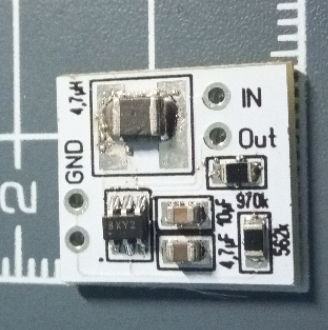
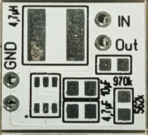

# 3,3V Step-Up für maximale kapazität ausnutzen der Batterien und Akkus
## benötigte Hardware
 * 1x MCP1640T-I/CHY **SOT-23-6**
 * 1x Kondensator 4,7µF MLCC **0805**
 * 1x Kondensator 10µF MLCC **0805**
 * 1x Widerstand 562k Ohm **0805**
 * 1x Widerstand 976k Ohm **0805**
 * 1x Spule 4,7µH **1206 / 1210 / 1812** min. 50mA

Die mindest Batteriespannung zum Start der Schaltung beträgt 0,65V, sobald diese mit Spannung Versorgt ist können die Zellen bis 0,35V entladen werden. Somit ist die Zelle völlig leer. Der Arduino benötigt eine Spannung von min. 1,8V danach schaltet er aber, mit dem Step Up werden auch bei einer Eingangsspannung von 0,35V am Ausgang bei 20mA Last noch 2,3V ausgegeben. Bei der Nutzung von Akkus bitte beachtet das diese sehr weit entladen werden, nicht alle Akkus mögen das. Nutzt 2 Akkus paralell!

[Schaltplan siehe Seite 2](https://www.google.com/url?sa=t&rct=j&q=&esrc=s&source=web&cd=3&ved=2ahUKEwimu_XM7aLjAhUL5aYKHV7hB44QFjACegQIAxAC&url=http%3A%2F%2Fww1.microchip.com%2Fdownloads%2Fen%2FDeviceDoc%2F20002234D.pdf&usg=AOvVaw3vI1z42j1OuQBprTFb_Yut)

Abmaße: 16 x 14 mm

[Kontakt via Facebook](https://www.facebook.com/ronny.thomas.83)

[Kontakt via Homematic Forum](https://homematic-forum.de/forum/memberlist.php?mode=viewprofile&u=13127)

